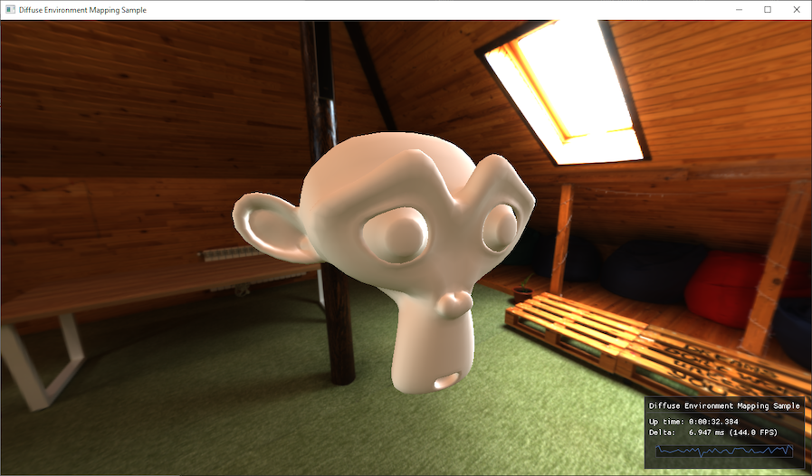

# Diffuse Environment Mapping Sample

Sample which demonstrates the use of the `DemoFramework::D3D12::ReflectionProbe` class by displaying the high resolution environment map in the background and lighting an object in the scene with just the environment's low resolution irradiance map.

